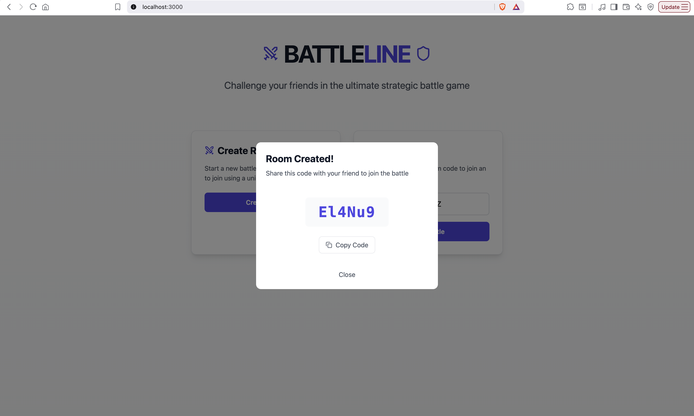
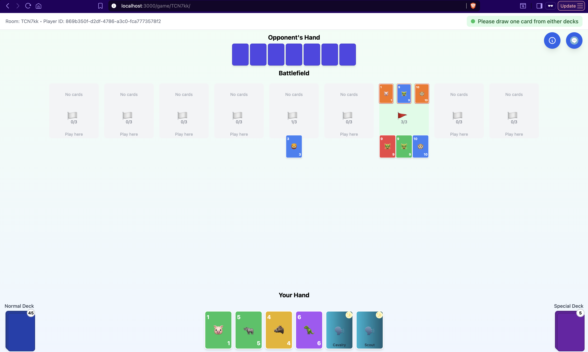
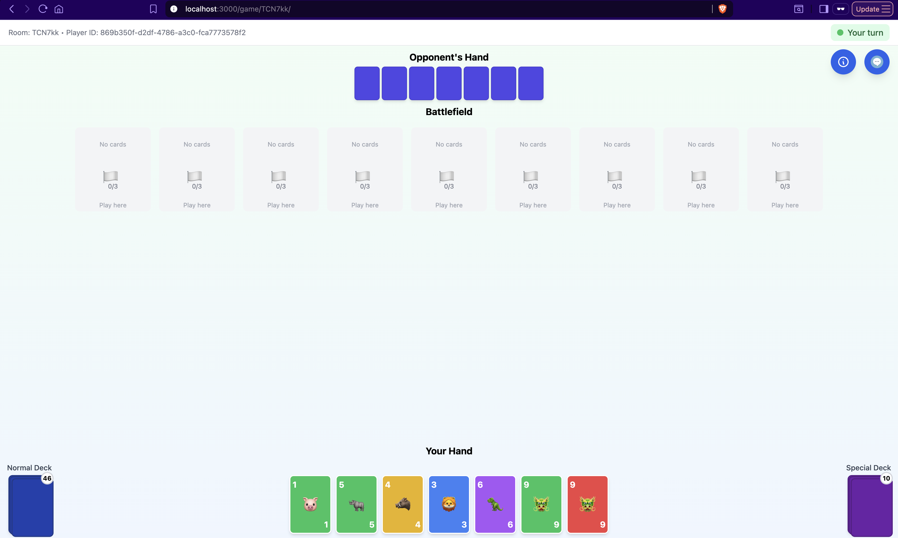

# ⚔️ BattleLine

**BattleLine** is a real-time, two-player strategic card game built for the web. Challenge your friends to a tactical duel where every move counts — plan your plays, outsmart your opponent, and capture flags on the battlefield!





---

## 🎮 Features

- **Room System** – Instantly create or join private game rooms using a unique 6-character code.
- **Real-Time Gameplay** – Synchronized state updates using WebSockets for smooth multiplayer experience.
- **Card-Based Strategy** – Build formations and compete for control over 9 battlefield flags.
- **Dynamic Turns** – Play, draw, and react as the game evolves turn by turn.
- **Modern UI** – Clean, minimal interface built with Next.js, TailwindCSS, and React components.
- **Responsive Design** – Works seamlessly across desktop and mobile devices.

---

## 🧠 How to Play

1. **Create a Room** – Click "Create Room" to start a new match and share your code with a friend.
2. **Join a Room** – Enter a valid code to connect to an existing match.
3. **Battle Begins** –
   - Each player has a hand of cards.
   - Play cards onto one of the nine battlefield flags.
   - Try to form stronger formations than your opponent.
   - Capture 5 flags total, or 3 adjacent flags, to win the game!

---

## 🛠️ Tech Stack

| Layer                   | Technology                  |
| ----------------------- | --------------------------- |
| Frontend                | Next.js (React)             |
| Styling                 | TailwindCSS                 |
| Real-Time Communication | WebSockets                  |
| Backend                 | Node.js / Express + GraphQL |
| State Management        | React Context``````````     |

---

## 🚀 Getting Started

### 1️⃣ Clone the repo

```bash
git clone https://github.com/deidaraiorek/battleline.git
cd battleline
```

### 2️⃣ Install dependencies

```bash
npm install
```

### 3️⃣ Run the app

```bash
npm run dev
```

Open [http://localhost:3000](http://localhost:3000) to start playing.

---

## 📸 Screenshots

**Room Creation**


**Gameplay Interface**


**Battle in Action**


---

## 💡 Future Improvements

- Add matchmaking and ranked mode
- Improve AI opponent logic
- Add sound effects and animations
- Leaderboard and game history tracking

---

## 👨‍💻 Author

Built by [**Dei Pham**](https://github.com/deidaraiorek)  
If you enjoy the project, feel free to ⭐ star the repo and share feedback!
